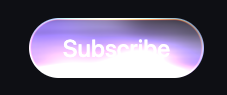

# 🌊 Liquid Metal WebGL Button

> Nút bấm **Liquid Metal** với hiệu ứng khúc xạ chất lỏng kim loại và sóng phản chiếu ánh sáng (iridescent fluid refraction) bằng **WebGL 2.0**.
> **Zero external dependencies** — Không cần Three.js hay bất kỳ thư viện 3D nào khác!

[](https://liquid-metal-btn.vercel.app/)
[](https://opensource.org/licenses/MIT)

🔗 **Trải nghiệm trực tiếp:** [https://liquid-metal-btn.vercel.app/](https://liquid-metal-btn.vercel.app/)

<p align="center">
  <a href="https://liquid-metal-btn.vercel.app/" target="_blank" rel="noopener noreferrer">
    
  </a>
  &nbsp;&nbsp;
  <a href="https://liquid-metal-btn.vercel.app/" target="_blank" rel="noopener noreferrer">
    
  </a>
</p>

---

## 📁 Cấu trúc thư mục dự án

Toàn bộ mã nguồn đã được tổ chức thành các thư mục chuyên biệt cho từng loại dự án và công nghệ:

```text
Liquid Metal Button/
├── screenshots/               # 📸 Ảnh chụp preview hiệu ứng thực tế
│   ├── img1.png
│   └── img2.png
│
├── src/
│   ├── core/                  # ⚡ Lõi Vanilla JS & WebGL2 (không phụ thuộc framework)
│   │   ├── LiquidButtonCore.js
│   │   └── README.md          # Hướng dẫn chi tiết cho Vanilla JS
│   │
│   ├── react/                 # ⚛️ React & Next.js Component (JSX & TSX)
│   │   ├── LiquidButton.jsx   # Dành cho React thông thường
│   │   ├── LiquidButton.tsx   # Dành cho React + TypeScript
│   │   └── README.md          # Hướng dẫn chi tiết cho React / Next.js
│   │
│   ├── web-component/         # 🌐 Web Component (<liquid-button>) & Tailwind CSS
│   │   ├── LiquidButtonElement.js
│   │   └── README.md          # Hướng dẫn chi tiết cho Web Component
│   │
│   └── standalone/            # 📦 Gói độc lập (1 file duy nhất cho HTML tĩnh, WordPress, CDN)
│       ├── liquid-button-standalone.js
│       └── README.md          # Hướng dẫn nhúng HTML tĩnh
│
├── examples/                  # 🎯 Các ví dụ chạy thực tế mẫu
│   ├── 01-html-standalone/    # Ví dụ HTML thuần (nhúng 1 file script)
│   │   └── index.html
│   ├── 02-vanilla-js/         # Ví dụ Vanilla JS ES Module (điều khiển bằng JS)
│   │   ├── index.html
│   │   └── main.js
│   ├── 03-react/              # Ví dụ React Component mẫu
│   │   ├── App.jsx
│   │   └── README.md
│   └── 04-tailwind-web-component/ # Ví dụ tạo kiểu trực tiếp bằng Tailwind CSS
│       └── index.html
│
├── index.js                   # Entry point xuất khẩu đầy đủ (Core, Element, React)
├── index.d.ts                 # Định nghĩa TypeScript Types
├── package.json
└── README.md                  # Tài liệu hướng dẫn tổng quan
```

---

## ⚡ Hướng dẫn nhanh: Copy file nào vào dự án của bạn?

| Bạn đang làm dự án gì? | File bạn cần copy | Cách import / sử dụng |
| :--- | :--- | :--- |
| **React / Next.js** | Copy `src/react/` + `src/core/LiquidButtonCore.js` | `<LiquidButton text="..." onClick={...} />` |
| **HTML tĩnh / WordPress / Landing Page** | Copy 1 file duy nhất: `src/standalone/liquid-button-standalone.js` | `<liquid-button>...</liquid-button>` |
| **Vanilla JS (Vite, Webpack, Rollup...)** | Copy `src/core/LiquidButtonCore.js` | `new LiquidButtonCore(container, options)` |
| **Vue / Svelte / Astro / Tailwind CSS** | Copy `src/web-component/` + `src/core/LiquidButtonCore.js` | `<liquid-button class="h-14 px-8 ...">` |

---

## 1. ⚛️ Dành cho React & Next.js

### Bước 1: Copy file vào dự án
Copy 2 file sau vào thư mục `components/` của bạn:
1. `src/react/LiquidButton.jsx` (hoặc `LiquidButton.tsx` nếu dùng TypeScript)
2. `src/core/LiquidButtonCore.js`

### Bước 2: Sử dụng trong Component
```jsx
'use client'; // Bắt buộc nếu dùng Next.js App Router
import React from 'react';
import { LiquidButton } from './components/LiquidButton';

export default function HeroSection() {
  return (
    <div style={{ background: '#000', padding: 40, textAlign: 'center' }}>
      {/* Cách 1: Nút cơ bản */}
      <LiquidButton 
        text="Trải Nghiệm Miễn Phí"
        height={56}
        radius="14px"
        color="#00ffff"
        borderColor="rgba(0, 255, 255, 0.3)"
        btnBg="#051018"
        fluidColor1="#00f0ff"
        fluidColor2="#002b4d"
        onClick={() => console.log('Button clicked')}
      />

      {/* Cách 2: Truyền icon SVG hoặc children tùy biến */}
      <LiquidButton
        height={56}
        radius="999px"
        paddingX="32px"
        color="#ffd700"
        borderColor="rgba(255, 215, 0, 0.35)"
        btnBg="#141006"
        fluidColor1="#ffaa00"
        fluidColor2="#3d2600"
        gap="10px"
        onClick={() => console.log('Pro Clicked!')}
      >
        <svg width="20" height="20" viewBox="0 0 24 24" fill="none" stroke="currentColor" strokeWidth="2">
          <polygon points="12 2 15.09 8.26 22 9.27 17 14.14 18.18 21.02 12 17.77 5.82 21.02 7 14.14 2 9.27 8.91 8.26 12 2"></polygon>
        </svg>
        <span style={{ fontWeight: 600 }}>Nâng cấp VIP</span>
      </LiquidButton>
    </div>
  );
}
```

---

## 2. ⚡ Dành cho Vanilla JavaScript (Vite, Webpack, ES Modules)

### Bước 1: Copy file
Chỉ cần copy **1 file duy nhất**: `src/core/LiquidButtonCore.js`.

### Bước 2: Sử dụng
```javascript
import { LiquidButtonCore } from './LiquidButtonCore.js';

const container = document.getElementById('my-button-slot');

// Khởi tạo nút
const button = new LiquidButtonCore(container, {
  text: "Bắt đầu ngay",
  height: 54,
  borderRadius: "14px",
  textColor: "#ffffff",
  borderColor: "rgba(255, 255, 255, 0.2)",
  btnBg: "#0f1115",
  fluidColor1: "#ff007a",
  fluidColor2: "#4a00e0",
  paddingX: 30
});

// Bắt sự kiện click
button.btn.addEventListener('click', () => {
  console.log('Nút đã được click!');
});

// Cập nhật thông số động không cần render lại WebGL
button.updateOptions({
  text: "Đang tải...",
  disabled: true
});
```

---

## 3. 🌐 Dành cho HTML tĩnh, WordPress, Landing Page (Standalone All-in-One)

Không cần cài đặt `npm`, không cần `package.json`, không cần build tool!

### Bước 1: Copy file
Chỉ cần copy **1 file duy nhất**: `src/standalone/liquid-button-standalone.js`.

### Bước 2: Nhúng vào file HTML
```html
<!DOCTYPE html>
<html lang="vi">
<head>
  <meta charset="UTF-8" />
  <title>Landing Page</title>
</head>
<body style="background: #000; padding: 50px;">

  <!-- Khai báo thẻ <liquid-button> -->
  <liquid-button
    height="54"
    radius="14px"
    padding-x="28px"
    color="#00ffff"
    border-color="rgba(0, 255, 255, 0.3)"
    btn-bg="#04121a"
    fluid-color1="#00f0ff"
    fluid-color2="#002b4d"
    onclick="console.log('Button clicked')"
  >
    <svg width="20" height="20" viewBox="0 0 24 24" fill="none" stroke="currentColor" stroke-width="2">
      <path d="M5 12h14M12 5l7 7-7 7"/>
    </svg>
    <span>Đăng ký tài khoản</span>
  </liquid-button>

  <!-- Nhúng 1 file script duy nhất trước thẻ đóng </body> -->
  <script src="./liquid-button-standalone.js"></script>

</body>
</html>
```

---

## 4. 🎨 Tạo kiểu bằng Tailwind CSS & Thuộc tính chuẩn HTML

`<liquid-button>` hỗ trợ hoàn toàn việc định kiểu trực tiếp bằng các utility class của **Tailwind CSS** hoặc **CSS Variables**, kết hợp với toàn bộ thuộc tính chuẩn của thẻ HTML:

```html
<liquid-button
  class="h-14 px-8 rounded-xl bg-neutral-900 border border-yellow-500/30 text-yellow-400 font-semibold text-sm gap-2.5"
  style="--fluid-1: #ffaa00; --fluid-2: #3a2500; --rim: #ffd700;"
  onclick="handleCheckout(this.dataset.planId)"
  data-plan-id="pro_annual"
  data-tracking="hero_cta"
  aria-label="Đăng ký gói thường niên"
  title="Nhấn để đăng ký"
>
  <svg width="20" height="20" viewBox="0 0 24 24" fill="none" stroke="currentColor" stroke-width="2">
    <polygon points="12 2 15.09 8.26 22 9.27 17 14.14 18.18 21.02 12 17.77 5.82 21.02 7 14.14 2 9.27 8.91 8.26 12 2"></polygon>
  </svg>
  <span>Bắt đầu ngay</span>
</liquid-button>
```

### Các lớp Tailwind được nhận diện tự động:
- **Kích thước & Bo góc:** `h-12`, `h-14`, `h-16`, `rounded-md`, `rounded-xl`, `rounded-2xl`, `rounded-full`,...
- **Padding:** `px-6`, `px-8`, `p-4`,...
- **Màu chữ & Font:** `text-yellow-400`, `text-white`, `text-sm`, `font-semibold`,...
- **Màu nền & Viền:** `bg-neutral-900`, `bg-zinc-800`, `border-yellow-500/30`,...
- **Khoảng cách:** `gap-2`, `gap-3`,...

### Bảng biến CSS (CSS Custom Properties):
| Biến CSS | Ý nghĩa | Ví dụ |
| :--- | :--- | :--- |
| `--fluid-1` | Màu chất lỏng WebGL thứ nhất | `--fluid-1: #ff007a;` |
| `--fluid-2` | Màu chất lỏng WebGL thứ hai (gradient) | `--fluid-2: #3a0022;` |
| `--rim` | Màu tia sáng phản xạ mép viền | `--rim: #ff44aa;` |
| `--ripple` | Màu sóng tỏa ra khi tương tác | `--ripple: #ffffff;` |
| `--btn-bg` | Màu nền tấm nền (plate) | `--btn-bg: #121008;` |
| `--border` | Màu viền kim loại | `--border: rgba(255, 215, 0, 0.3);` |

### Thuộc tính chuẩn HTML:
- **`onclick="..."`**: Tự động nhận diện sự kiện click của trình duyệt.
- **`disabled`**: Khi có thuộc tính `disabled`, nút sẽ mờ 55%, chuyển grayscale nhẹ và chặn toàn bộ thao tác click/submit.
- **`type="submit"` / `type="reset"`**: Đặt bên trong `<form>` sẽ tự động gọi `form.requestSubmit()` hoặc reset form theo chuẩn HTML5.
- **`data-*`**: Thoải mái gán dữ liệu tùy chỉnh (vd: `data-id="99"`), truy cập qua `element.dataset`.

---

## 📋 Bảng tra cứu toàn bộ tham số (API Reference)

| Tên Option (JS) | Prop React | Attribute (Web Component) | Kiểu dữ liệu | Mặc định | Ý nghĩa & Mô tả |
| :--- | :--- | :--- | :--- | :--- | :--- |
| `text` | `text` | `text` | `string` | `'Sign up'` | Nội dung chữ hiển thị |
| `content` | `children` | *(Thẻ con)* | `ReactNode` / `string` | `undefined` | SVG icon, badge, span truyền trực tiếp |
| `height` | `height` | `height` | `number` | `52` | Chiều cao của nút (px) |
| `borderRadius` | `radius` | `radius` | `string` | `'999px'` | Độ bo góc (`'0px'` đến `'999px'`) |
| `textColor` | `color` | `color` | `string` | `'#ffffff'` | Màu chữ hiển thị |
| `borderColor` | `borderColor` | `border-color` | `string` | `rgba(255,255,255,0.15)` | Màu viền kim loại |
| `btnBg` | `btnBg` | `btn-bg` | `string` | `'#0b0c0e'` | Màu nền nút ở trạng thái nghỉ |
| `fluidColor1` | `fluidColor1` | `fluid-color1` | `string` | `'#251249'` | Màu chất lỏng WebGL thứ nhất |
| `fluidColor2` | `fluidColor2` | `fluid-color2` | `string` | `'#070212'` | Màu chất lỏng WebGL thứ hai |
| `rimColor` | `rimColor` | `rim-color` | `string` | `'#ffffff'` | Màu tia phản quang mép viền |
| `paddingX` | `paddingX` | `padding-x` | `number \| string` | `calc(280*u)` | Khoảng đệm ngang bên trong nút |
| `gap` | `gap` | `gap` | `number \| string` | `calc(88*u)` | Khoảng cách giữa icon và chữ |
| `disabled` | `disabled` | `disabled` | `boolean` | `false` | Khóa nút và ngắt sự kiện |

---

## 💡 Lưu ý về Hiệu năng (WebGL Best Practices)

- Mỗi nút Liquid Metal sử dụng **1 WebGL 2.0 Context** để render shader phản xạ chất lỏng ở tốc độ 60 FPS mượt mà.
- **Khuyên dùng:** Sử dụng làm các nút điểm nhấn hành động chính (Hero CTA, Đăng ký, Mua hàng, Thanh toán).
- **Hạn chế:** Tránh dùng vòng lặp render hàng chục nút cùng lúc trên một trang danh sách dài vì có thể vượt quá số lượng WebGL Context cho phép của trình duyệt (thông thường tối đa 8 - 16 contexts).
